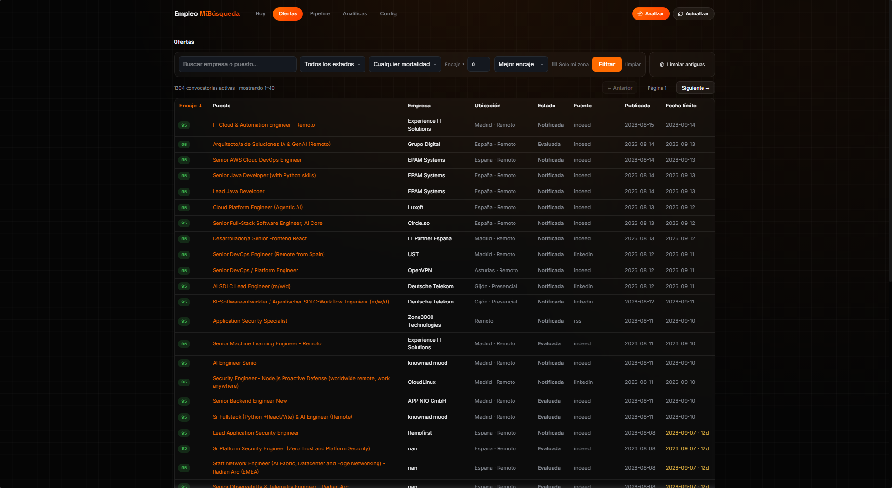
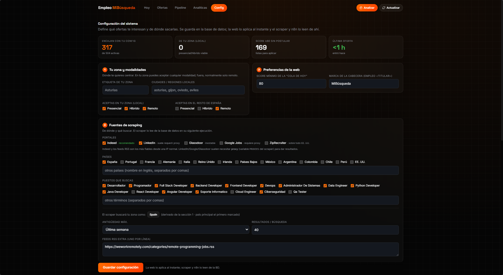
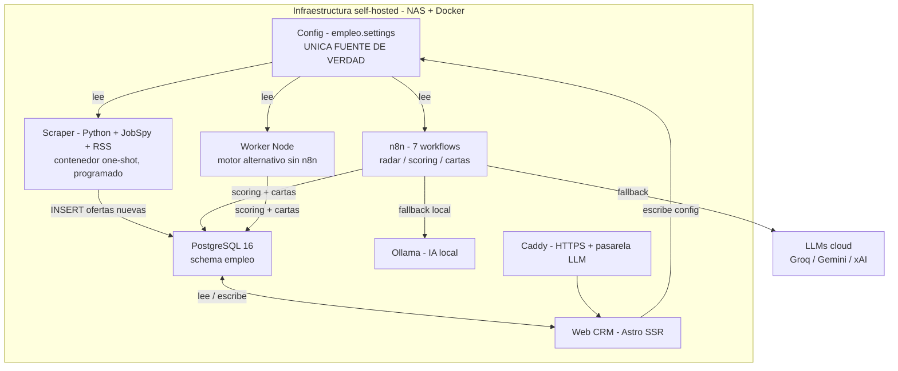

<div align="center">

# Job-radar

**Búsqueda de empleo automatizada y self-hosted: scraping + scoring con IA multi-proveedor, todo gobernado desde una única pantalla de configuración.**

[](https://astro.build)
[](https://www.typescriptlang.org)
[](https://www.postgresql.org)
[](https://n8n.io)
[](https://github.com/speedyapply/JobSpy)
[](https://www.docker.com)
[](https://ollama.com)
[](LICENSE)
[](https://portfolio.ivanjonasfc.dev/proyectos/job-radar/)


</div>

---

## Qué es Job-radar

Job-radar es un **sistema self-hosted de búsqueda de empleo** que automatiza lo tedioso y deja al candidato solo lo que importa: decidir a qué apuntar. Cada pocas horas rastrea portales (Indeed, LinkedIn) y feeds RSS, **puntúa cada oferta con IA** (0–100 según una rúbrica de encaje), genera **CV y carta a medida** por oferta y lo organiza todo en un CRM tipo Kanban — corriendo 24/7 en infraestructura propia (NAS + Docker), sin depender de servicios de pago.

Lo que lo hace distinto: **todo se controla desde una única pantalla de Configuración**. Zona, modalidades, portales, términos de búsqueda, umbrales, perfil y claves de IA viven en la base de datos; la web los escribe y el scraper, n8n y el worker los leen de ahí. **Cambias un campo en la web y todo el sistema obedece — sin tocar código ni redesplegar.** Eso lo hace adaptable a cualquier persona o sector (de "desarrollador" a "enfermero") con solo rellenar un formulario.

> **Un diseño, dos motores.** El scoring y la generación pueden correr en **n8n** (7 workflows, robusto, 24/7) o en un **worker Node autónomo** (stack mínimo de 3 piezas: Postgres + web + worker). Ambos leen la misma configuración de la BD.

Ficha completa en el [portfolio](https://portfolio.ivanjonasfc.dev/proyectos/job-radar/).

## 🚀 Puesta en marcha rápida

```bash
git clone https://github.com/IvanjonasFC/Job-radar.git && cd Job-radar
cp .env.example .env          # rellena las variables (contraseña de BD, etc.)
docker compose up -d --build  # Postgres + web + worker
```

Abre **http://127.0.0.1:3010**, entra en **Config** y define tu zona, portales, tu perfil y una clave de IA (Groq y Gemini tienen plan gratuito). A partir de ahí, **todo el sistema obedece a esa configuración**. Para lanzar una recogida de ofertas: `docker compose --profile scraper run --rm scraper`.

## Características

- **Radar de ofertas** — scraping (Python + JobSpy: Indeed/LinkedIn) + feeds RSS, con prefiltro por título configurable.
- **Scoring con IA** — rúbrica 0–100 (skills 35 · seniority 20 · encaje 15 · modalidad/ubicación 15 · proyección 15) que devuelve JSON; descarta lo no‑IT automáticamente.
- **IA multi-proveedor con fallback** — Groq → Gemini → xAI (Grok) → Ollama local. Si uno se satura, el siguiente responde; una oferta sin puntuar vuelve a la cola y se reintenta.
- **CV y carta a medida** — generación por oferta desde tu perfil real, sin inventar experiencia ni títulos.
- **CRM completo** — cola de hoy, buscador de ofertas, pipeline Kanban (drag & drop) y recordatorios de seguimiento.
- **Analíticas en vivo** — embudo de conversión, tecnologías más pedidas y tiempo de reacción.
- **Todo configurable desde la web** — una única fuente de verdad en Postgres; adaptable a cualquier perfil sin tocar código.
- **Self-hosted y privado** — corre en tu NAS/servidor; tus datos y tus claves nunca salen de tu infraestructura.

## Capturas

<table>
  <tr>
    <td align="center"><b>Analíticas</b><br/></td>
    <td align="center"><b>Pipeline (Kanban)</b><br/></td>
  </tr>
  <tr>
    <td align="center"><b>Ofertas</b><br/></td>
    <td align="center"><b>Configuración</b><br/></td>
  </tr>
</table>

## Arquitectura



## El sistema manda desde Config (fuente de verdad única)

El corazón del diseño es la tabla `empleo.settings` (una fila JSONB). La **web** la edita; el **scraper**, **n8n** y el **worker** la leen. No hay configuración duplicada ni valores a fuego repartidos por el código:

| Ajuste | Lo escribe | Lo consume | Cuándo aplica |
| --- | --- | --- | --- |
| Zona, modalidades, umbral, marca | Web | Web + n8n (estado de oferta) | Al instante |
| Portales, términos, países, antigüedad, RSS | Web | Scraper | En el siguiente scrapeo programado |
| Perfil profesional | Web | Scoring + cartas (n8n / worker) | En la siguiente ejecución |
| Claves de IA (Groq / Gemini / xAI / Ollama) | Web | Scoring + cartas (n8n / worker), con *fallback* a `.env` | En la siguiente ejecución |

Consecuencia práctica: **para adaptar el sistema a otra persona no se toca código** — se rellena el formulario de Config (perfil, zona, sector, claves) y funciona. Los valores por defecto del repositorio son genéricos y **no contienen datos personales**.

## El motor de IA (multi-proveedor, con fallback)

El scoring y la generación hablan con cualquier proveedor compatible con la API de OpenAI (`/chat/completions`) y prueban una **cadena ordenada** hasta obtener una respuesta válida:

```
Groq (rápido)  →  Gemini  →  xAI (Grok)  →  Ollama (local, ilimitado)
```

Cada clave se toma primero de Config (BD) y, si está vacía, del entorno (`.env`). Si un proveedor se satura o cae, entra el siguiente; y si una oferta no logra puntuarse, **vuelve a estado `nueva` y se reintenta** en la siguiente pasada — el sistema se auto‑cura y no pierde ofertas.

<details>
<summary>Ver detalle del stack</summary>

### Web / CRM
| Componente | Detalle |
| --- | --- |
| **Astro 5 (SSR)** | `output: server`, adaptador `@astrojs/node` (standalone). Datos en vivo desde Postgres. |
| **TypeScript** | Tipado en la capa de datos, config y endpoints. |
| **React (islas) + Recharts + dnd-kit** | Kanban con drag & drop y gráficos de las analíticas. |
| **postgres-js / Drizzle** | Acceso a Postgres con rol de mínimos privilegios (`empleo_web`). |
| **Zod** | Validación de entrada. |

### Automatización e IA
| Componente | Detalle |
| --- | --- |
| **n8n** | 7 workflows: radar (scrape RSS + scoring), digest, acciones (carta/CV, aplicar, descartar), healthcheck, recordatorios, IA on-demand, guardar carta. |
| **Worker Node** | Motor alternativo (solo dependencia `pg`) que replica el bucle: scoring, generación y acciones. Reduce el sistema a 3 piezas. |
| **Multi-LLM** | Groq, Google Gemini, xAI (Grok), Ollama local — en cadena, con reintento. |

### Scraping e infraestructura
| Componente | Detalle |
| --- | --- |
| **Python + JobSpy** | Indeed y LinkedIn; contenedor de un solo uso lanzado por el programador del NAS. |
| **feedparser (RSS)** | Feeds de remoto global (WeWorkRemotely, Tecnoempleo…). |
| **Docker + Compose** | Stack de 3 piezas (db + web + worker) con perfiles opcionales `scraper` y `backup`. |
| **Caddy** | HTTPS automático y pasarela hacia los LLMs. |

</details>

## Seguridad y privacidad

- **Self-hosted**: todo corre en tu NAS/servidor; las ofertas, tu perfil y tus claves nunca salen de tu red.
- **Secretos fuera del repo**: `.env` y credenciales están en `.gitignore`; solo se versiona `.env.example` con placeholders. Los workflows de n8n del repo van **neutralizados** (sin tokens, dominios ni datos personales).
- **Rol de BD de mínimos privilegios** para la web (`empleo_web`): lee y solo actualiza lo imprescindible.
- **Login** en la web (sesión con cookie httpOnly) y proxy server-side hacia n8n (la URL interna nunca llega al navegador).

<details>
<summary>Estructura del proyecto</summary>

```text
Job-radar/
├── src/                      # Web CRM (Astro SSR + TypeScript)
│   ├── pages/                # hoy, ofertas, pipeline, analiticas, configuracion, login + api/
│   ├── lib/                  # config.ts (settings), db.ts, queries.ts, auth.ts
│   └── components/           # KanbanBoard.tsx
├── db/
│   └── schema.sql            # esquema empleo (job_offers, applications, generated, settings, events)
├── automation/
│   ├── n8n/                  # 7 workflows exportados (neutralizados) + profile.example.md
│   ├── worker/               # motor Node autónomo (alternativa a n8n)
│   └── scraper/              # scraper Python (JobSpy + RSS), lee Config de la BD
├── assets/                   # capturas del CRM
├── docker-compose.yml        # db + web + worker (+ perfiles scraper / backup)
├── Dockerfile                # imagen de la web
└── .env.example              # plantilla de variables (sin secretos)
```

</details>

<details>
<summary>Cómo ejecutar el proyecto</summary>

**Requisitos:** Docker + Docker Compose (y, para desarrollo, Node 20+). Una clave de IA (Groq/Gemini/xAI) o un Ollama local.

**1) Configura el entorno:**
```bash
cp .env.example .env      # rellena DATABASE_URL, N8N_WEBHOOK_BASE y (si usas compose) DB_PASSWORD
```

**2) Levanta el stack (Postgres + web + worker):**
```bash
docker compose up -d --build
# Web en http://127.0.0.1:3010  ·  el worker puntúa en bucle
docker compose --profile scraper run --rm scraper   # una pasada de scraping (opcional)
```

**3) Abre la web → pestaña Config** y rellena zona, portales, tu perfil y una clave de IA. A partir de ahí, el scraper y el motor obedecen a esa configuración.

**Desarrollo local (sin Docker):**
```bash
npm install
npm run dev     # http://localhost:4321
```

**Vía n8n (opcional, en vez del worker):** importa `automation/n8n/*.json` en tu instancia, apunta `N8N_WEBHOOK_BASE` a sus webhooks y pon tus claves en Config (o en el `.env` de n8n como respaldo).

</details>

## Roadmap

- [ ] Normalizar los *verdicts* de la IA a un conjunto fijo (ES/EN unificados).
- [ ] Panel de estado de proveedores de IA (latencia y errores por proveedor).
- [ ] Más portales vía proxy (InfoJobs/Google Jobs) y más países.
- [ ] Exportar CV/carta a PDF/DOCX desde la propia web.
- [ ] Modo multiusuario (varios perfiles sobre la misma instancia).

---

## Autor

**Iván Jonás Fernández Correa** — Técnico Superior en DAM + ASIR. Perfil híbrido desarrollo + sistemas (full-stack, self-hosted, IA aplicada).

<p>
  <a href="https://portfolio.ivanjonasfc.dev/proyectos/job-radar/"></a>
  <a href="https://www.linkedin.com/in/ivanjonasfc/"></a>
</p>

## Licencia

Distribuido bajo licencia [MIT](LICENSE).
